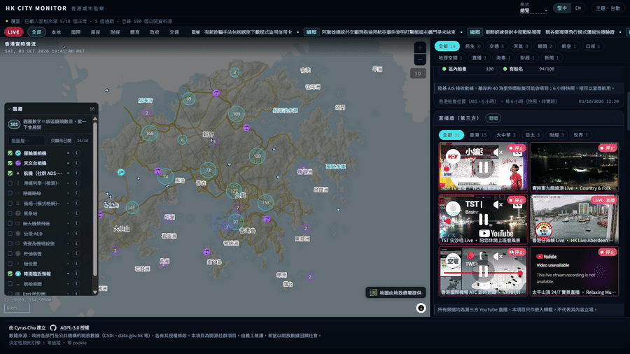

# HK City Monitor

**A real-time situational-awareness dashboard for Hong Kong — one map, many open data sources, no API keys.**

[](https://github.com/Cyruschu430/hk-city-monitor/actions/workflows/ci.yml)

[Live deployment](https://hk-city-monitor.pages.dev) · [Data sources](SOURCES.md) · [Attribution](ATTRIBUTION.md) · [Security](SECURITY.md) · [Self-hosting](SELF_HOSTING.md) · [Technical specification](TECH_SPEC.md)

---



*The dashboard in use: switching scenario modes, jumping through the keyboard palette and reading the city brief. [Full 1:24 demo (MP4, 94 MB)](https://github.com/Cyruschu430/hk-city-monitor/releases/download/v0.2.0/hk-city-monitor-demo.mp4).*

## Overview

HK City Monitor is an open-source, browser-based dashboard that consolidates Hong Kong's public open data into a single live map. Traffic cameras, weather observations, transport schedules, border-crossing wait times, aircraft positions, market indices and civic-service data are rendered onto one MapLibre / deck.gl surface, with every reading traceable to its publisher.

The application is fully static. There is no database, no user account and no API key in the shipped bundle. Sources that a browser cannot read directly — because the publisher sends no permissive `Access-Control-Allow-Origin` header — are routed through a single whitelist-limited Cloudflare Worker proxy.

The goal is a *verifiable* picture of the territory: a reader should be able to click any number and reach the government or institutional page it came from.

## Highlights

### Ten scenario modes, each answering one question

The same map and the same 207 sources, rearranged around one concrete question at a time — so the dashboard answers something instead of showing everything:

| Mode | The question it answers |
| --- | --- |
| Typhoon | Will signal 8 be hoisted, and will my flight leave tomorrow? |
| Border Crossing | How long is the queue at the control point right now? |
| Water Suspension | Is my district under a water suspension, and when does it end? |
| Weather | Will it rain today, and do I need an umbrella? |
| Traffic | Which road is jammed, and when is the next train? |
| Drone | Can I fly now, where is it windy, and where is it banned? |
| Freight | Is freight and logistics moving right now? |
| Health | How long is the A&E wait, and where is the nearest AED? |
| Civic | Any water suspension, parking or bad air in my district? |
| Live | What is happening in Hong Kong right now? |

Modes are data, not code: `data/verticals.json` decides which modes exist, and which panels and layers each one shows.

### ⌘K — jump to anything

Press **Ctrl-K** or **⌘K** to search every mode, every panel and every map camera by name, in the current language, and go straight there. The whole dashboard becomes reachable from the keyboard without learning the layout first.

### A city brief written twice a day from the live feeds

A scheduled GitHub Action assembles **eleven live feeds** — aircraft positions, berth vacancy, water-suspension notices, carpark occupancy, baselines, A&E waiting times, control-point queues, the AQHI, 10-minute wind and the warning summary — trims them to a context under 7 KB, and asks a free LLM for one short bilingual brief at 08:00 and 20:00 HKT.

The browser makes **no model calls**: the brief is a static JSON file, fetched like any other panel. The model is not permitted to compute anything — the figures arrive under their publishers' own field names with their own timestamps, the prompt forbids arithmetic and inference, and the panel links to the published file, which records the model id, every input and the generation time. Deciding that something is *wrong* stays with the deterministic rule engine, never the model.

## Engineering rules

A dashboard that shows live numbers is easy to fake. These are the rules this one is held to instead, and each is enforced by something runnable rather than by good intentions. Several exist because an earlier version of this project broke one.

1. **No figure without a source.** Every number on screen carries the publisher it came from and that publisher's own timestamp. Nothing is inferred, interpolated or scored; panels show traceable observations only, and a source that has never answered is not shown at all.
2. **An LLM is banned from the runtime path.** The single exception is the twice-daily city brief: generated off-line, shipped as a static file, forbidden from computing anything, and printed alongside its own model id and inputs.
3. **A source is working only after a real probe.** `scripts/probe_sources.py` requests every endpoint and regenerates the catalogue from the responses — 160 of 180 reachable at the last run. A declaration in `sources.json` is a hypothesis until the network confirms it.
4. **The UI is verified in the DOM, never from a screenshot.** Screenshots have misreported this application's layout before, so the browser checks assert on rendered DOM state instead of pixels.
5. **Withdrawn features are recorded, not deleted.** When a panel or a mode is removed, the registry keeps the reason and the route back, so the same idea is not silently rebuilt a month later.
6. **The counts in these documents are checked.** `scripts/check_doc_counts.py` compares every figure written into the README, the landing page and the guides against `sources.json`, `data/panels.json`, `data/layers.json` and `data/verticals.json`. A registry change that leaves a stale number in prose fails the build.
7. **Nothing is called finished on assertion.** Typecheck, the unit tests, the data-registry validator and the document-count check all run in CI on every push to `master`.

## Objectives

The project is built around a single principle: **OSINT depends on breadth, openness and publicness.**

- **Breadth** — if a free, public, Hong Kong-filterable source exists, it is integrated. The question is never "is this useful" but "is this real data".
- **Openness** — every source is documented in this repository with its endpoint, update cadence, key requirement and licence. There are no hidden sources.
- **Publicness** — every figure links back to its origin, so a reader can verify it independently instead of trusting the dashboard.
- **A hard boundary** — "open" applies to *data*. The project publishes no unverified allegations about individuals, performs no person-tracking and stores no personal data. See [SECURITY.md](SECURITY.md).

### Non-goals

- HK City Monitor is **not** part of any government system and is **not** affiliated with the HKSAR Government. It does not use the name 「AI城市大腦」 (an official programme announced in the 2026 Policy Address) as a product name, to avoid any implication of official status.
- It does not ingest non-public data (internal departmental sensors, private back-ends).
- It does not compute or display unverified inference scores; panels show traceable raw observations only.

## Features

Data is organised into **panels** (individual readouts) that appear in context-specific **verticals** (pre-arranged views for a scenario, such as typhoon mode). The current build ships 42 panels.

**Live imagery**
- Transport Department traffic snapshots (1,013 cameras, ~2-minute cadence)
- Hong Kong Observatory weather cameras (34 stations, ~5-minute cadence)
- Camera wall and embedded television news streams

**Weather and environment**
- Weather warnings, current conditions and the 9-day forecast
- Weather radar and satellite imagery
- Air Quality Health Index (per-station, plus a 24-hour history)
- Rainfall nowcast and tide/radiation/earthquake feeds

**Transport**
- Driving-speed indication and special traffic news
- Carpark vacancy
- Bus ETA (KMB / CTB) and MTR next-train
- Public-transport routes and fares

**Border and civic services**
- Land boundary control-point waiting times (Security Bureau)
- Accident & Emergency waiting times
- Water-suspension notices, LCSD bookable-session availability, AED locations

**Aviation, marine and markets**
- Live aircraft positions (community ADS-B, multiple independent mirrors) and airport flight information
- Vessel arrivals/departures and berth vacancy
- Hong Kong and global market indices

**Spatial base**
- CSDI vector layers, address lookup (ALS) and place-name search
- 3D building models and terrain

## Tech stack

| Layer | Technology |
|---|---|
| Front end | TypeScript, Vite 7 |
| Map rendering | MapLibre GL JS, deck.gl 9 (2D and 3D) |
| Basemap & imagery | Esri ArcGIS Online public services — World Imagery, World Topographic Map, Light Gray Canvas (keyless) |
| Basemap (Hong Kong) | Lands Department topographic and imagery tiles |
| 3D tiles | `@loaders.gl/3d-tiles` |
| Edge proxy | Cloudflare Worker (single, whitelist-limited) |
| Static hosting | Cloudflare Pages |
| Scheduling | GitHub Actions / host cron (optional live collectors) |
| Browser tests | Playwright (Chromium) |

There is deliberately no application server, database or ORM. The only server-side component is the edge proxy, which exists solely to add CORS headers and keep any future credentials out of the client.

## Architecture

```
                    ┌──────────────────────────────────────────┐
  Browser  ───────► │  Static bundle (Cloudflare Pages)        │
                    │  MapLibre + deck.gl, panels, verticals   │
                    └───────────────┬──────────────────────────┘
                                    │
        ┌───────────────────────────┼─────────────────────────────┐
        │                           │                             │
  Direct fetch                Edge proxy (Worker)          Static live data
  (publisher sends            (publisher has no CORS;      (high-frequency feeds
   ACAO: *)                    whitelist + rate limit)      pre-published as JSON)
        │                           │                             │
        ▼                           ▼                             ▼
   Government /               Government /                  GitHub raw branch /
   institutional APIs         institutional APIs            static host
```

**Contract:** collectors always emit static JSON and the front end only ever reads JSON. Adding a data source means adding one collector and one panel; the core rendering logic does not change.

## Repository layout

```
.
├── web/                    Front-end application (TypeScript + Vite)
│   ├── src/
│   │   ├── data/           Panel and vertical definitions
│   │   ├── lib/            Parsers, adapters, formatting, rendering helpers
│   │   ├── map/            Map layers, symbols, popups, 3D overlays
│   │   ├── styles/         Application CSS
│   │   └── ui/             Panel and status-bar components
│   └── test/               Browser checks (Playwright)
├── worker/                 Cloudflare Worker edge proxy (whitelist + rate limit)
├── scripts/                Collectors, builders, probes and validators (Python / Node)
├── data/                   Static snapshots and generated registries
├── docs/                   Project landing page (GitHub Pages)
├── sources.json            Source registry — the single source of truth for data sources
├── SOURCES.md              Generated source catalogue (do not edit by hand)
├── ATTRIBUTION.md          Generated attribution list (do not edit by hand)
├── TECH_SPEC.md            Technical and data-source specification
├── SECURITY.md             Security policy and threat model
└── SELF_HOSTING.md         Deployment guide
```

## Getting started

Requires **Node 22+**.

```bash
git clone https://github.com/Cyruschu430/hk-city-monitor.git
cd hk-city-monitor/web
npm ci
npm run build
npx vite preview --host 127.0.0.1 --port 4173
```

This runs the front end against direct-fetch sources only. Around half of the panels load this way; the remainder are proxy-backed and display an explicit error state until the Worker is deployed. See [SELF_HOSTING.md](SELF_HOSTING.md) for the full procedure, including the Worker and the optional live collectors.

## Development workflow

The project follows a spec-driven workflow: sources are validated with a real network request before a panel is built, and a change is not considered complete until it is verified by a runnable check.

```bash
cd web
npm run typecheck        # TypeScript, 0 errors expected
npm test                 # 5 assertion suites; no browser, no server
npm run check:all        # 9 checks (needs a preview server on 127.0.0.1:4173)
cd ..
python3 scripts/validate_config.py    # registry: ids, references, panel wiring
python3 scripts/check_doc_counts.py   # every count in the docs matches a registry
```

CI runs the typecheck, the unit tests and both Python validators on every push to `master`; `check:all` additionally exercises the rendered UI and needs a local preview server.

Key conventions:

- **Verify against the real source.** A source is marked working only after a live probe returns the expected payload; `scripts/probe_sources.py` regenerates `SOURCES.md` from these results.
- **Assume Hong Kong time, and prove it.** Several publishers ship timestamps with no timezone. `new Date()` parses those in the machine's own zone, so a parser bug of that kind is invisible in Hong Kong and shows up as an eight-hour error anywhere else. `TZ=UTC npm test` is the run that catches it.
- **Verify the UI in the DOM, not from a screenshot.** Browser checks assert on rendered DOM state, because screenshots have previously misreported layout.
- **Guard the request budget.** A cold load is measured against a fixed Worker-request budget so that adding a panel cannot silently exhaust the free-tier quota.
- **Attribute everything.** Attribution is generated from `sources.json`; it is never hand-edited.

## Roadmap

Delivered:

- **v0.1** — static map, Transport Department and Observatory cameras, weather warnings, market panels, camera wall, live streams.
- **v0.2** — design-system rewrite, full-screen map with floating panels, focus drawer, staleness states, clustering, keyboard control.

Planned:

- **v0.3 — global free layers.** Aircraft (community ADS-B), earthquakes (USGS), natural events (NASA EONET), traffic speed, special traffic news, carpark vacancy, bus/minibus/ferry ETA, AQHI, radar and satellite imagery.
- **v0.3.5 — civic services.** Border wait times, A&E waiting times, water-suspension notices, LCSD bookable sessions, AED locations, cross-border ferry arrivals.
- **v0.4 — persistent-connection collectors.** AIS vessel tracking (subject to a measured coverage test), event NLP layer.
- **v0.5 — 3D and variants.** Globe ↔ city view, CSDI 3D buildings, timeline scrubber, thematic variants (transport / weather / market).
- **v1.0 — platform.** Programmatic access (MCP/REST API for agents), desktop shell, full variant set, and an offline snapshot mode.

## Data sources

Every source is declared in [`sources.json`](sources.json) and probed against the live network. The generated catalogue — endpoint, publisher, update cadence, key requirement, licence and last probe result — is in [`SOURCES.md`](SOURCES.md). Publisher attribution obligations are listed in [`ATTRIBUTION.md`](ATTRIBUTION.md).

Sources are predominantly Hong Kong Government open data (data.gov.hk, CSDI) and institutional feeds (the Observatory, the Airport Authority, the Consumer Council), supplemented by community and global open APIs filtered to the Hong Kong bounding box.

## Licensing and attribution

- Source code is licensed under **AGPL-3.0-only**.
- Data remains the property of its publishers; attribution is mandatory and is rendered on the map and in panel footers.
- The project is **not affiliated with, endorsed by, or part of the HKSAR Government**.

## Credits

Created and maintained by Cyrus Chu, a Hong Kong GIS practitioner.

Basemap and imagery are provided by **Esri ArcGIS Online public services** (World Imagery, World Topographic Map and Light Gray Canvas) and by the **Lands Department**. Both are credited on the map face and in the panel footers.

Architecture is inspired by [`koala73/worldmonitor`](https://github.com/koala73/worldmonitor) (AGPL-3.0); this project is an independent Hong Kong implementation.
